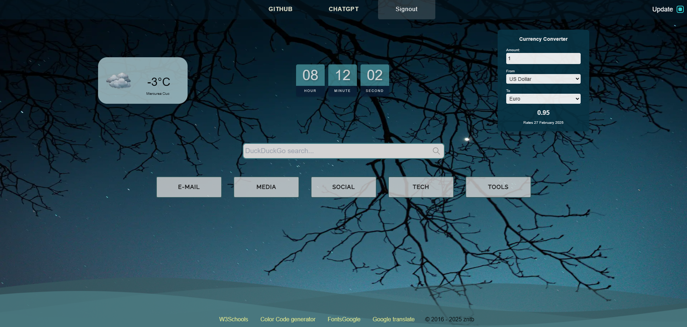

# Startpage - Personalized Dashboard with Next.js

**Startpage** is a highly customizable and user-friendly dashboard built using Next.js. It offers a seamless experience for users to manage their favorite links, access live weather data, view the current time, and convert currencies—all in one place.



## Features

- User Authentication: Users can register and log in to save their personalized settings and lists.

- Dynamic Categories: Five customizable dropdown categories that users can edit, reorder, and manage.

- Live Weather Data: Displays real-time weather information based on the user's current location.

- Clock: Shows the current time.

- Currency Converter: Allows users to convert currencies on the fly.

- Editable Lists: Users can add, edit, and delete links within each category.

- Persistent Data: All user data is stored in a database, ensuring that users can access their personalized dashboard from any device.

- Footer Links: Useful links are available in the footer for quick access.

### How It Works

- Guest Users: Unregistered users get a basic list of links.

- Registered Users: Logged-in users can create and manage individual categories and lists.

- Edit Mode: By moving the mouse to the top right corner, an 'update' checkbox appears, allowing users to edit their lists and categories.

### Technologies Used

- Next.js: For server-side rendering and static site generation. [Nextjs Docs](https://nextjs.org/docs).

- React: For building the user interface.

- Auth.js: For user authentication and management. [Auth.js Docs](https://authjs.dev/getting-started/installation?framework=next-js).

- Mongodb Database with Prisma ORM: To store user data and preferences.

- Weather API: For fetching live weather data. [Openweather guide](https://openweathermap.org/guide)

- Currency Conversion API: For real-time currency conversion.

## Getting Started

1. Clone the repository:

```bash
git clone https://github.com/zntb/nextjs-startpage.git
```

2. Install dependencies:

```bash
npm install
```

3. Set up environment variables for APIs and database connections.

```env
# MongoDB database connection string
DATABASE_URL="your_database_url"

# OpenWeather API key
WEATHER_API_KEY="your_weather_api_key"
# waqi.info API key
AQI_API_KEY="your_aqi_api_key"

NEXT_PUBLIC_DEFAULT_LATITUDE=set your default latitude
NEXT_PUBLIC_DEFAULT_LONGITUDE=set your default longitude
NEXT_PUBLIC_DEFAULT_LANGUAGE=set your default language

# Auth.js
AUTH_URL="http://localhost:3000" # or your production URL
AUTH_SECRET="your_auth_secret_key"
AUTH_GOOGLE_ID="your_google_client_id"
AUTH_GOOGLE_SECRET="your_google_client_secret"

# user
NEXT_PUBLIC_USER="your_github_username"

# exchangerate-api.com API key
NEXT_PUBLIC_EXCHANGE_API_KEY="your_exchange_api_key"
```

4. Run the development server:

```bash
npm run dev
```

### Contribution

Feel free to fork the project, open issues, and submit pull requests. Any contributions you make are greatly appreciated.

### License

This project is licensed under the MIT License. See the [LICENSE](./LICENSE) file for details.
